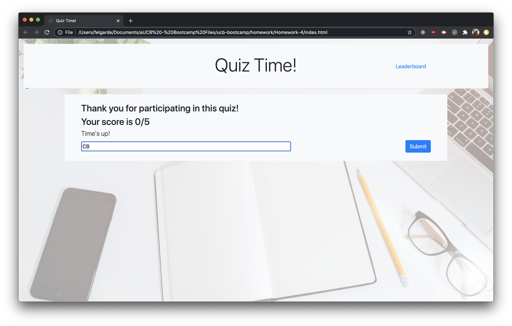
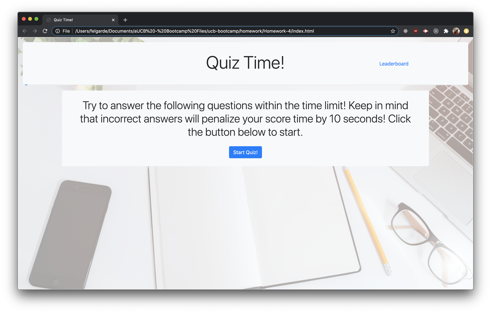
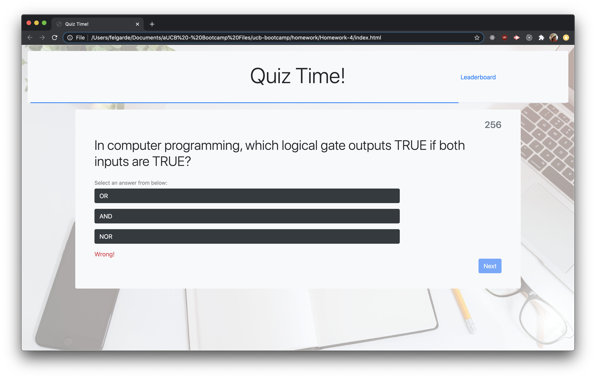
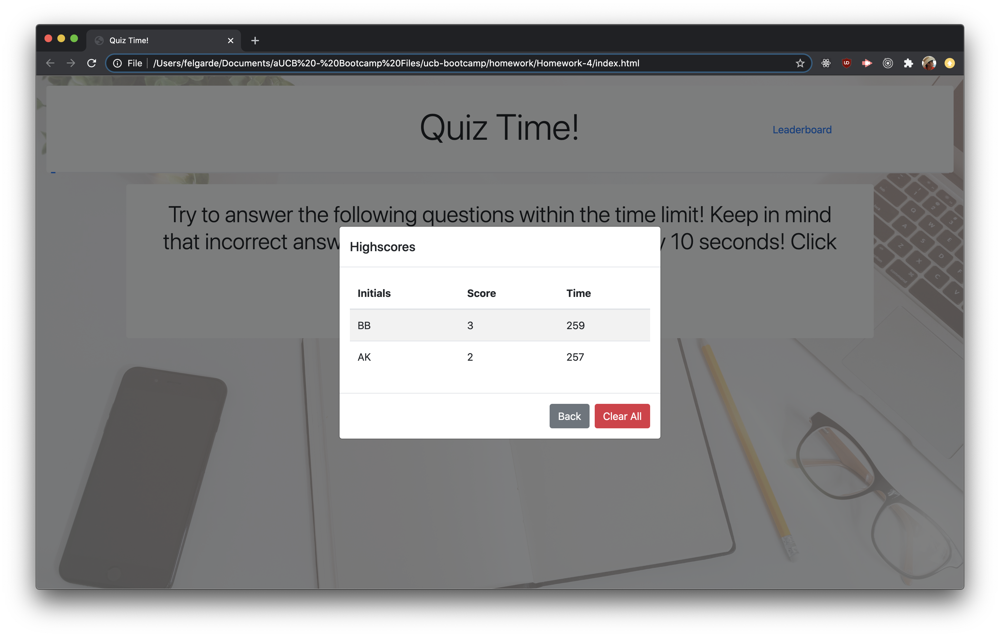

This repository is a week 3 homework submission for UCB Bootcamp

The homework task is to create a quiz using javscript. It should generate html elements and have a local storage leaderboard that saves even when refreshed. The quiz should have a timer that goes down every second and every wrong answer will decrease the time.

Below are screenshots of the homework from the project

This link goes to the live version of the homework.

[Live homework](https://berjonbatistiana.github.io/Homework-4/)

